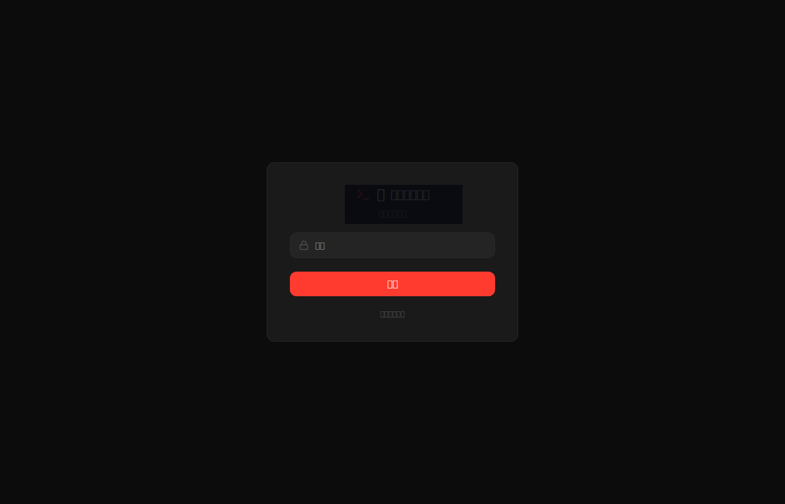
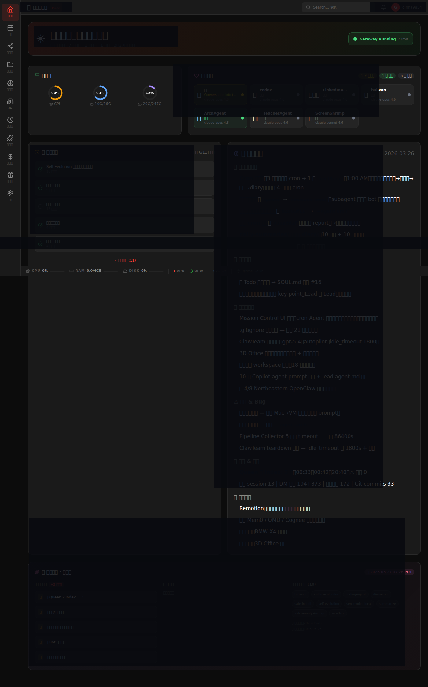
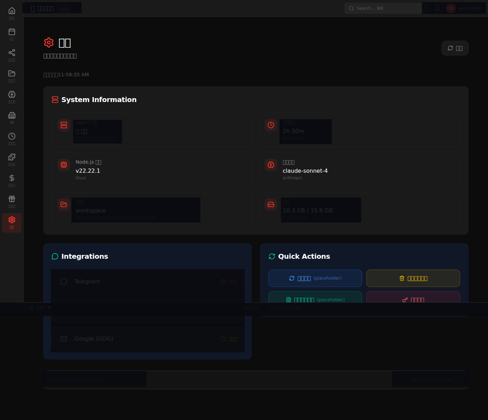
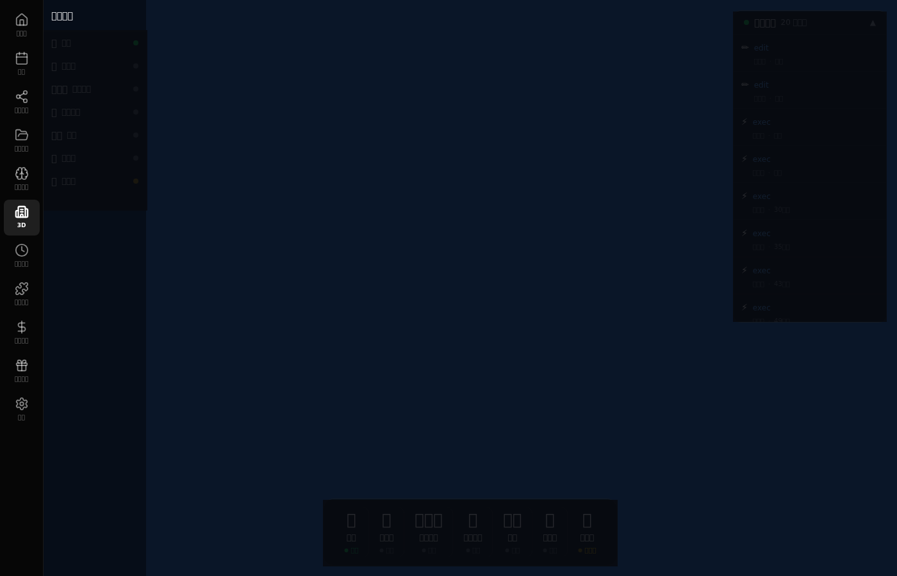

# FeiControl — Mission Control

A real-time dashboard and control center for [OpenClaw](https://openclaw.ai) AI agent instances. Built with Next.js, React 19, and Tailwind CSS v4.

> **FeiControl** runs alongside your OpenClaw installation and reads configuration, agents, sessions, memory, and logs directly from the host filesystem. No extra database or backend required — OpenClaw is the backend.

> **Attribution:** This project is adapted from [TenacitOS](https://github.com/carlosazaustre/tenacitOS). See [ATTRIBUTION.md](./ATTRIBUTION.md) for details.

---

## Features

- **📊 System Monitor** — Real-time host metrics (CPU, RAM, Disk, Network) + PM2/Docker status
- **🤖 Agent Dashboard** — All agents, their sessions, token usage, model, and activity status
- **💰 Cost Tracking** — Real cost analytics from OpenClaw sessions (SQLite)
- **⏰ Cron Manager** — Visual cron manager with weekly timeline, run history, and manual triggers
- **📋 Activity Feed** — Real-time log of agent actions with heatmap and charts
- **🧠 Memory Browser** — Explore, search, and edit agent memory files
- **📁 File Browser** — Navigate workspace files with preview and in-browser editing
- **🔎 Global Search** — Full-text search across memory and workspace files
- **🔔 Notifications** — Real-time notification center with unread badge
- **🏢 Office 3D** — Interactive 3D office with one desk per agent (React Three Fiber)
- **📺 Terminal** — Read-only terminal for safe status commands
- **🔐 Auth** — Password-protected with rate limiting and secure cookie

---

## Screenshots

All screenshots below were captured from a live local instance and redacted for public release.

**Login** — simple password protection for a self-hosted control surface



**Dashboard** — activity overview, agent status, and widgets



**Settings / System** — environment-aware configuration and runtime status



**Office 3D** — interactive 3D office with one voxel avatar per agent (React Three Fiber)



---

## Requirements

- **Node.js** 18+ (tested with v22)
- **[OpenClaw](https://openclaw.ai)** installed and running on the same host
- **PM2** or **systemd** (recommended for production)
- **Caddy** or another reverse proxy (for HTTPS in production)

---

## How it works

FeiControl reads directly from your OpenClaw installation:

```
$OPENCLAW_DIR/                ← defaults to ~/.openclaw
├── openclaw.json             ← agents list, channels, models config
├── workspace/                ← main agent workspace (MEMORY.md, SOUL.md, etc.)
├── workspace-<name>/         ← additional agent workspaces (one per sub-agent)
└── ...
```

The app uses the `OPENCLAW_DIR` environment variable to locate `openclaw.json` and all workspaces. **No manual agent configuration needed** — agents are auto-discovered from `openclaw.json`.

---

## Installation

### 1. Clone the repository

```bash
git clone https://github.com/your-org/feicontrol.git
cd feicontrol
npm install
```

You can place this anywhere on the host that runs OpenClaw. A common convention is inside `$OPENCLAW_DIR/workspace/`, but any directory works.

### 2. Configure environment

```bash
cp .env.example .env.local
```

Edit `.env.local`:

```env
# --- Auth (required) ---
# Strong password to log in to the dashboard
ADMIN_PASSWORD=your-secure-password-here

# Random secret used to sign the auth cookie
# Generate with: openssl rand -base64 32
AUTH_SECRET=your-random-32-char-secret-here

# --- OpenClaw paths (optional — defaults work for standard installs) ---
# OPENCLAW_DIR=~/.openclaw

# --- Branding (customize for your instance) ---
NEXT_PUBLIC_AGENT_NAME=Mission Control
NEXT_PUBLIC_AGENT_EMOJI=🤖
NEXT_PUBLIC_AGENT_DESCRIPTION=Your AI co-pilot, powered by OpenClaw
NEXT_PUBLIC_AGENT_LOCATION=             # e.g. "Tokyo, Japan"
NEXT_PUBLIC_BIRTH_DATE=                 # ISO date, e.g. "2026-01-01"
NEXT_PUBLIC_AGENT_AVATAR=               # path to image in /public, e.g. "/avatar.jpg"

NEXT_PUBLIC_OWNER_USERNAME=your-username
NEXT_PUBLIC_OWNER_EMAIL=your-email@example.com
NEXT_PUBLIC_TWITTER_HANDLE=@your-handle
NEXT_PUBLIC_COMPANY_NAME=YOUR ORGANIZATION
NEXT_PUBLIC_APP_TITLE=Mission Control
```

> **Tip:** `OPENCLAW_DIR` defaults to `~/.openclaw`. If your OpenClaw is installed elsewhere, set this variable to the correct absolute path.

### 3. Initialize data files

```bash
cp data/cron-jobs.example.json data/cron-jobs.json
cp data/activities.example.json data/activities.json
cp data/notifications.example.json data/notifications.json
cp data/configured-skills.example.json data/configured-skills.json
cp data/tasks.example.json data/tasks.json
```

### 4. Generate secrets

```bash
openssl rand -base64 32   # use as AUTH_SECRET
openssl rand -base64 18   # use as ADMIN_PASSWORD
```

### 5. Run

```bash
# Development
npm run dev
# → http://localhost:3000

# Production build
npm run build
npm start
```

Open `http://localhost:3000` and log in with the `ADMIN_PASSWORD` you set.

---

## Production Deployment

### PM2 (recommended)

```bash
npm run build

pm2 start npm --name "feicontrol" -- start
pm2 save
pm2 startup   # enable auto-restart on reboot
```

### systemd

Create `/etc/systemd/system/feicontrol.service` (adjust paths and user to your setup):

```ini
[Unit]
Description=FeiControl (Next.js)
After=network.target

[Service]
Type=simple
User=<your-user>
WorkingDirectory=/path/to/feicontrol
EnvironmentFile=/path/to/feicontrol/.env.local
Environment=NODE_ENV=production
ExecStart=/usr/bin/node ./node_modules/next/dist/bin/next start -H 127.0.0.1 -p 3000
TimeoutStartSec=5min
Restart=always
RestartSec=5

[Install]
WantedBy=multi-user.target
```

```bash
sudo systemctl daemon-reload
sudo systemctl enable feicontrol
sudo systemctl start feicontrol
```

### Reverse proxy — Caddy (HTTPS)

```caddy
your-domain.example.com {
    reverse_proxy localhost:3000
}
```

> When behind HTTPS, `secure: true` is set automatically on the auth cookie.

---

## Configuration

### Branding

All personal data stays in `.env.local` (gitignored). The `src/config/branding.ts` file reads from env vars — **never edit it directly** with your personal data. Use the `NEXT_PUBLIC_*` variables in `.env.local` instead.

### Agent discovery

Agents are auto-discovered from `openclaw.json` at startup. The `/api/agents` endpoint reads:

```json
{
  "agents": {
    "list": [
      { "id": "main", "name": "...", "workspace": "...", "model": {} },
      { "id": "studio", "name": "...", "workspace": "..." }
    ]
  }
}
```

Each agent can define its own visual appearance in `openclaw.json`:

```json
{
  "id": "studio",
  "name": "My Studio Agent",
  "ui": {
    "emoji": "🎬",
    "color": "#E91E63"
  }
}
```

### Office 3D — agent positions

The 3D office supports up to 6 agents with default desk positions. To customize positions, names, and colors, edit `src/components/Office3D/agentsConfig.ts`:

```ts
export const AGENTS: AgentConfig[] = [
  {
    id: "main",       // must match workspace ID in openclaw.json
    name: "...",      // display name
    emoji: "🤖",
    position: [0, 0, 0],
    color: "#FFCC00",
    role: "Main Agent",
  },
  // add more agents here
];
```

### 3D Avatar models

Place custom 3D avatars (Ready Player Me GLB format) in `public/models/`:

```
public/models/
├── main.glb        ← main agent avatar
├── studio.glb      ← workspace-studio agent
└── infra.glb       ← workspace-infra agent
```

The filename must match the agent `id` from `openclaw.json`. If no GLB is found, a colored sphere is used as fallback.  
See `public/models/README.md` for full instructions.

### Cost tracking

Usage data is collected from OpenClaw's SQLite databases:

```bash
# Collect once
npx tsx scripts/collect-usage.ts

# Set up automatic hourly collection
./scripts/setup-cron.sh
```

See [docs/COST-TRACKING.md](./docs/COST-TRACKING.md) for details.

---

## Project Structure

```
feicontrol/
├── src/
│   ├── app/
│   │   ├── (dashboard)/      # Dashboard pages (auth-protected)
│   │   ├── api/              # API routes
│   │   ├── login/            # Login page
│   │   └── office/           # 3D office page
│   ├── components/
│   │   ├── TenacitOS/        # OS-style UI shell (topbar, dock, status bar)
│   │   └── Office3D/         # React Three Fiber 3D office
│   ├── config/
│   │   └── branding.ts       # Branding constants (reads from env vars)
│   └── lib/                  # Utilities (pricing, queries, activity logger...)
├── data/                     # JSON data files (gitignored — use .example versions)
├── docs/                     # Extended documentation
├── public/
│   └── models/               # GLB avatar models (add your own)
├── scripts/                  # Setup and data collection scripts
├── .env.example              # Environment variable template
└── middleware.ts             # Auth guard for all routes
```

---

## Security

- All routes (including all `/api/*`) require authentication — handled by `src/middleware.ts`
- `/api/auth/login` and `/api/health` are the only public endpoints
- Login is rate-limited: **5 failed attempts → 15-minute lockout** per IP
- Auth cookie is `httpOnly`, `sameSite: lax`, and `secure` in production
- Terminal API uses a strict command allowlist — `env`, `curl`, `wget`, `node`, `python` are blocked
- **Never commit `.env.local`** — it contains your credentials

See [SECURITY.md](./SECURITY.md) for the full security policy and responsible disclosure process.

---

## Troubleshooting

**"Gateway not reachable" / agent data missing**

```bash
openclaw status
openclaw gateway start   # if not running
```

**"Database not found" (cost tracking)**

```bash
npx tsx scripts/collect-usage.ts
```

**Build errors after pulling updates**

```bash
rm -rf .next node_modules
npm install
npm run build
```

**Scripts not executable**

```bash
chmod +x scripts/*.sh
```

---

## Tech Stack

| Layer | Tech |
|---|---|
| Framework | Next.js 15 (App Router) |
| UI | React 19 + Tailwind CSS v4 |
| 3D | React Three Fiber + Drei |
| Charts | Recharts |
| Icons | Lucide React |
| Database | SQLite (better-sqlite3) |
| Runtime | Node.js 22 |

---

## Contributing

1. Fork the repo
2. Create a feature branch (`git checkout -b feat/my-feature`)
3. **Keep personal data out of commits** — use `.env.local` and `data/` (both gitignored)
4. Write clear commit messages
5. Open a PR

See [CONTRIBUTING.md](./CONTRIBUTING.md) for full guidelines.

---

## Attribution & Credits

This project is adapted from **TenacitOS** by Carlos Azaustre.  
See [ATTRIBUTION.md](./ATTRIBUTION.md) for upstream details, customization notes, and license acknowledgements.

---

## License

MIT — see [LICENSE](./LICENSE)

---

## Links

- [OpenClaw](https://openclaw.ai) — the AI agent runtime this dashboard is built for
- [OpenClaw Docs](https://docs.openclaw.ai)
- [Discord Community](https://discord.com/invite/clawd)
- [GitHub Issues](../../issues) — bug reports and feature requests
- [ATTRIBUTION.md](./ATTRIBUTION.md) — upstream credits
